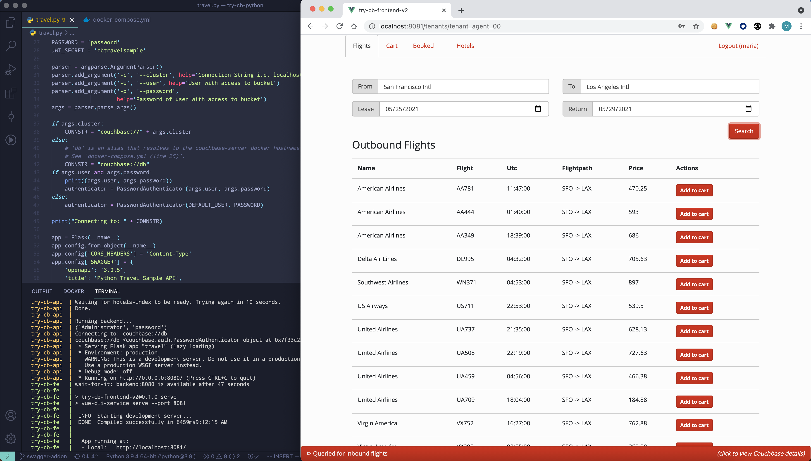

# Couchbase Ruby travel-sample Application REST Backend

This is a sample application for getting started with [Couchbase Server] and the Ruby SDK.
The application runs a single page web UI for demonstrating SQL++ for Documents, Sub-document requests and Full-Text Search (FTS) querying capabilities.
It uses Couchbase Server together with the [Sinatra] web framework for [Ruby], [Swagger] for API documentation, [Vue] and [Bootstrap].

The application is a flight planner that allows the user to search for and buy flight routes based on airports and dates.
Airport selection happens dynamically using an autocomplete box bound to SQL++ queries on the server side. After selecting a date, it searches
for applicable air flight routes from a populated database. An additional page allows users to search for Hotels using less structured keywords.




## Prerequisites

To download the application you can either download [the archive](https://github.com/couchbaselabs/try-cb-ruby/archive/master.zip) or clone the repository:

    git clone https://github.com/couchbaselabs/try-cb-ruby.git

You can run the application with Docker, which starts all components for you.
You can also run it in a Mix-and-Match style, described below.


## Running the Application with Docker

You need [Docker](https://docs.docker.com/get-docker/) installed on your machine to run this application. 
A provided [_Dockerfile_](Dockerfile) and a [_docker-compose.yml_](docker-compose.yml) run Couchbase Server 7.0.0, the front-end [Vue application](https://github.com/couchbaselabs/try-cb-frontend-v2.git) and the Ruby REST API.

To launch the full application, run this command from a terminal:

    docker-compose --profile local up

> **_NOTE:_** You may need more than the default RAM to run the images.
Couchbase have tested the travel-sample apps with 4.5 GB RAM configured in Docker's Preferences -> Resources -> Memory.
When you run the application for the first time, it pulls/builds the relevant Docker images, so it may take some time.

This starts the backend, Couchbase Server 7.0.0 and the Vue frontend app.

You can find the backend API at http://localhost:8080/, the UI at
http://localhost:8081/ and Couchbase Server at http://localhost:8091/

You should then be able to browse the UI, search for airports and get flight route information.

To end the application press <kbd>Control</kbd>+<kbd>C</kbd> in the terminal
and wait for `docker-compose` to stop your containers.


## Mix and Match Services

Instead of running all services, you can start any combination of `backend`,
`frontend`, `db` via Docker, and take responsibility for starting the other
services yourself.

As the provided `docker-compose.yml` establishes dependencies between the services,
to make startup as smooth and automatic as possible, there is also an
alternative `mix-and-match.yml`.


### Bring Your Own Database

To run this application against your own configuration of Couchbase
Server, you need version 7.0.0 or later with the `travel-sample`
bucket setup.

> **_NOTE:_** If you aren't using Docker to start Couchbase Server, or you aren't using the
> provided wrapper `wait-for-couchbase.sh`, you need to create a full-text
> Search index on travel-sample bucket called 'hotels-index'. You can do this
> with the following command:

    curl --fail -s -u <username>:<password> -X PUT \
            http://<host>:8094/api/index/hotels-index \
            -H 'cache-control: no-cache' \
            -H 'content-type: application/json' \
            -d @fts-hotels-index.json

With a running Couchbase Server, you can pass the database details in:

    CB_HOST=10.144.211.101 CB_USER=Administrator CB_PSWD=password docker-compose -f mix-and-match.yml up backend frontend

The Docker image runs the same checks as usual, and also create the
`hotels-index` if it doesn't already exist.


### Running the Ruby API Application Manually

You may want to run the backend one your local machine.
You can still use Docker to run the Database and Frontend components if desired.

1. Make sure that you have `Ruby 3.0` or later installed on your machine.
2. Copy the Gemfile from the sample-app-ruby folder in [parent image repository](https://github.com/couchbaselabs/sample-app-parent-images) to the sample application directory
3. Setup the [Bundler] dependency management tool so you can install the project dependencies.
4. Install the project dependencies by running:
   `bin/setup`
   This runs `bundle install` for you
5. Start the database:
   `docker compose -f mix-and-match.yml up -d db`
   `export CB_HOST=localhost CB_USER=Administrator CB_PSWD=password`
   `./wait-for-couchbase.sh echo Couchbase is ready!`
   The `wait-for-couchbase` wrapper waits until the database has started, and loaded the sample data and indexes.
   If the database is already running, you can skip this step
6. Start the backend:
   `bin/server`
7. Start the frontend:
   `docker-compose -f mix-and-match.yml up frontend`

### Running the Frontend Manually

To run the frontend components manually without Docker, follow the guide
[here](https://github.com/couchbaselabs/try-cb-frontend-v2)


## REST API Reference and Tests

All the travel-sample apps conform to the same interface, which means that the same database configuration and Vue.js frontend can use any backend.

You can find the Swagger/OpenApi version 3 documentation on the backend at `http://localhost:8080/apidocs` once you've started the application.

You can also view a read-only version at https://docs.couchbase.com/python-sdk/current/hello-world/sample-application.html#

To further verify that every application conforms to the API, there is a [test suite][try-cb-test], which you can run with the command:

```
docker-compose --profile test up test
```

If you are running locally, and want to extend or modify the travel-sample application, you can make changes to both the code and the tests in parallel:

 * Start the backend server locally, for example using "Running the Ruby API Application Manually" above.
 * Check out the [test suite][try-cb-test] repository in a separate working directory, and run the tests manually, as per the instructions.


[Couchbase Server]: https://www.couchbase.com/
[Ruby SDK]: https://docs.couchbase.com/ruby-sdk/current/hello-world/overview.html
[Sinatra]: http://sinatrarb.com/intro.html
[Ruby]: https://www.ruby-lang.org/en/
[Swagger]: https://swagger.io/resources/open-api/
[Vue]: https://vuejs.org/
[Bootstrap]: https://getbootstrap.com/
[Bundler]: https://bundler.io/
[try-cb-test]: https://github.com/couchbaselabs/try-cb-test/
